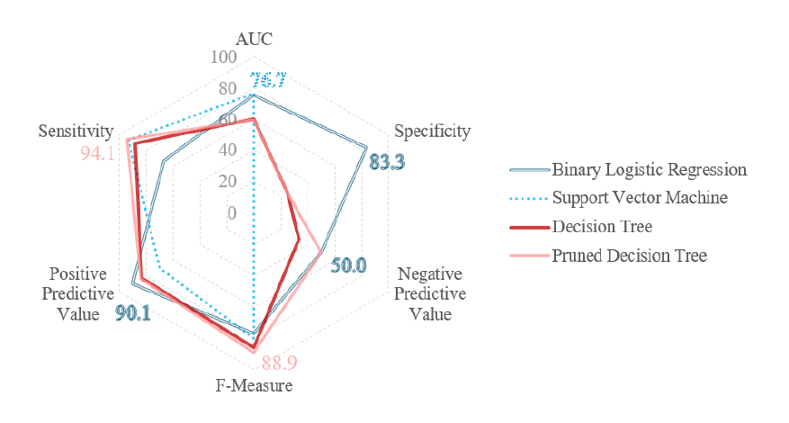

# Developing Predictive Models for Care Quality Commission Inspection Ratings in Adult Social Care

  
  &nbsp;&nbsp;&nbsp;&nbsp;&nbsp;&nbsp;
  

## Project Summary
The following project was conducted as part of the requirement for completing an MSc in Business Analytics at the University of Bath. The study investigates the use of supervised machine learning algorithms to predict Care Quality Commission (CQC) inspection outcomes for adult social care providers, using a dataset from Bath and North East Somerset Council.
Due to ethical and data protection constraints, the full dataset is not included in this repository.

### Machine Learning Models Used

- Binary Logistic Regression
- Decision Tree
- Pruned Decision Tree
- Support Vector Machine

## Data Collection
**Please Note:** Commissioner data is not publicly available and will not be uploaded due to data protection and sensitivity.
### CQC Ratings
- [Google Drive - CQC Historical Data](https://drive.google.com/drive/folders/0B1jvn_rdpdEzMUtiNVoyeW9rb2M?resourcekey=0-J1nm1TwV6Vf_N9DArEe6XQ)
- [Python Script to Extract from CQC API](https://github.com/LauraWiltshire/MSc_Business_Analytics/blob/main/CQC_API_Script.py)
- [R Script to inner join CQC & Commissioner Data](https://github.com/LauraWiltshire/MSc_Business_Analytics/blob/main/Join_CQC_and_Commissioner_Data.R)
  
## Data Analysis Scripts
- [EDA and Data Visualisation - R](https://github.com/LauraWiltshire/MSc_Business_Analytics/blob/main/EDA_CQC_Ratings.R)
- [Machine Learning Models - R](https://github.com/LauraWiltshire/MSc_Business_Analytics/blob/main/CQC_Machine_Learning.R)
  
## Interactive Visualisations
- [3D Feature Space Plot](https://laurawiltshire.github.io/MSc_Business_Analytics/3D_PLOT.html)
- [Radial Basis Function Transformed Feature Space Plot for SVM](https://laurawiltshire.github.io/MSc_Business_Analytics/3D_PLOT_RBF.html)

## Results and Conclusion

  

The binary logistic regression model offered the most balanced performance overall, achieving strong specificity and AUC, yet it underperformed in sensitivity, indicating a risk of failing to identify underperforming providers. The pruned decision tree offered higher sensitivity but low specificity, while the SVM model performed least effectively, likely due to class imbalance. While the models demonstrated varying degrees of predictive performance, none exhibited sufficient predictive strength or generalisability to warrant deployment in live decision-making. Several limitations were identified, including the small dataset, limited feature diversity, and class imbalance, which collectively constrained model accuracy. Future research could benefit from inter-authority collaboration to expand dataset size and diversity, incorporation of longitudinal outcome data, and the development of hybrid models that integrate ML with expert judgment.

    This dissertation set out to explore the feasibility and ethical implications of applying ML techniques to predict Care Quality Commission (CQC) ratings for adult social care providers, using a dataset derived from Bath and North East Somerset Council’s Quality and Risk Dashboard. Drawing on locally held commissioning data and publicly available CQC inspection records, three types of supervised learning algorithms, binary logistic regression, decision trees (standard and pruned), and SVM, were evaluated against several performance metrics to determine their predictive validity and potential operational use.
    
    
While the models demonstrated varying degrees of predictive performance, none exhibited sufficient predictive strength or generalisability to warrant deployment in live decision-making. The binary logistic regression model offered the most balanced performance overall, achieving strong specificity and AUC, yet it underperformed in sensitivity, indicating a risk of failing to identify underperforming providers. The pruned decision tree offered higher sensitivity but low specificity, while the SVM model performed least effectively, likely due to class imbalance. These results suggest the importance of carefully selecting and validating models in public sector contexts where false negatives and false positives carry significant ethical and operational consequences.

Beyond the technical findings, the study raises critical questions about the construction and use of provider risk indicators in adult social care. In particular, the prominence of previous CQC ratings as a predictor of current CQC rating raises significant concerns about potential circularity or institutional bias, which may reinforce historical inequalities rather than describe true provider quality. Additionally, the reliance on CQC ratings as an outcome variable, while pragmatic, limits the capacity of predictive models in reflecting real-time quality issues or accounting for more contextual complexity. The use of static, retrospective ratings brings forward the need for richer, more dynamic indicators of service performance, such as those chosen by experts in the adult social care, which are already used in the Quality and Risk Dashboard, to enhance the practical relevance of predictive analytics.

Several limitations were identified, including the small dataset, limited feature diversity, and class imbalance, which collectively constrained model accuracy. Despite these challenges, the study contributed to a growing body of evidence on data driven decision-making in adult social care. It offers a practice-based perspective on the barriers to predictive modelling in local government and affirms the value of transparent and explainable models. Looking ahead, future research could benefit from inter-authority collaboration to expand dataset size and diversity, incorporation of longitudinal outcome data, and the development of hybrid models that integrate ML with expert judgment. Moreover, ethical considerations around accountability must be embedded throughout the development cycle. In this way, predictive analytics may serve not as a replacement for professional expertise, but as a complementary tool to support more responsive data informed social care provision.

## Author
**Laura Wiltshire**

MSc Business Analytics, University of Bath

Bath and North East Somerset Council

## Contact
For any queries regarding this repository or collaboration, please reach out via [GitHub](https://github.com/LauraWiltshire) or [LinkedIn](https://www.linkedin.com/in/laura-wiltshire-0b7762299/)
